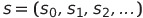
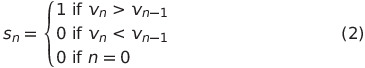
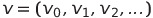
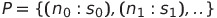
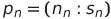
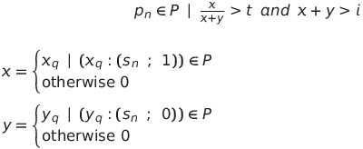
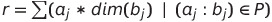
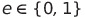
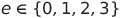

# Probabilistic compressibility as a measure of model efficacy

We can model the efficacy of a classification strategy that operates on time series data by comparing the relative compressibility of the data before and after applying the strategy. Specifically, given

<div align="center"></div>

<span hidden>
$$s = (s_0, s_1, s_2, ...)$$
</span>

where 

<div align="center"></div>

<span hidden>
$$
\begin{equation}
{s_n} = 
\begin{cases}
\text{1 if }{v_n} > {v_{n-1}}\\
\text{0 if }{v_n} < {v_{n-1}}\\
\text{0 if }n = 0
\end{cases}
\end{equation}
$$
</span>

and *v* is a time-ordered vector of prices

<div align="center"></div>

<span hidden>
$$v = (v_0, v_1, v_2, ...)$$
</span>

let 

<div align="center"></div>

<span hidden>
$$P = \{ (n_0: s_0), (n_1: s_1), .. \}$$ 
</span>

be the set of tuples containing improper substrings of *s* and the number of times each occurs in *P*, such that for every

<div align="center"></div>

<!--
$$
p_n = (n_n : s_n)
$$
-->

then

<div align="center"></div>

<!--
$$
p_n \in P \enspace | \enspace \frac{x}{x+y} > t \enspace and \enspace x+y > i

\newline

x = 
\begin{cases}
x_q \enspace | \enspace (x_q: (s_n\enspace;\enspace 1)) \in P\\
\text{otherwise 0}
\end{cases}

\newline

y = 
\begin{cases}
y_q \enspace | \enspace (y_q: (s_n\enspace;\enspace 0)) \in P\\
\text{otherwise 0}
\end{cases}
$$
-->

where *t* is some coefficient of probability and *i* is the minimum number of instances of a string for its tuple to accept membership in *P*, then define a *coverage* score

<div align="center"></div>

<!--
$$
r = \sum (a_j * dim(b_j) \enspace | \enspace (a_j: b_j) \in P )
$$
-->

In plain English, we start by transforming the time series data into a vector of 0s and 1s where these represent the classifications we want to encode. We then build a dictionary of substrings taken from the encoded data where the expectation of the next classification exceeds a given threshold and we have sufficient instances of it that we can make statistically meaningful deductions (typically *i* > 30). Finally we compute a coverage score based on the length of each retained string and the number of times it occurs in the dictionary.

The code to implement all the above follows.

```
def compress(dict, max_length=5, p=lambda q: q > 0.65, min_n=30):
  dates, values = sorted(dict.keys()), set(dict.values())
  indices = {key : [] for key in values}
  [indices[dict[dates[i]]].append(i) for i in range(len(dates)-1)] # indices by key
  retained, unprocessed = [], [[v] for v in values]
  while len(unprocessed):
    s = unprocessed.pop()
    matching = set(indices[s[0]])
    for i in range(1, len(s)):
      matching = matching.intersection([j-i for j in indices[s[i]]])
    if len(matching) > 0:
      accuracy = np.mean([dict[dates[j+len(s)]] & 1 for j in matching])
      if p(accuracy) and len(matching) >= min_n:
        retained.append({"s": s, "n": len(matching), "p": accuracy})
      elif len(s) < max_length:
        unprocessed += [s + [key] for key in values]
  coverage = sum([len(v["s"]) * v["n"] for v in retained])
  return sorted(retained, key = lambda r: len(r["s"])), coverage

def encode(dfl):
  return { dt : 1 if dfl.series[dt]["prev_delta"] > 0 else 0 for dt in dfl.s_dates }

def load_data(directory, symbol):
  return data_file_loader({"path": "%s/%s" % (directory, symbol)})
```

The workflow proceeds as follows:

## Test the data for inherent structure
It may be that the data contains some level of structure, and we can determine this without the need to generate a model. The `encode_null` method randomises the encoded data whilst preserving its distribution. Successive calls to `compress` return coverage metrics from the baseline vs. randomised data.

```
def encode_null(encoding):
  dates, vals = sorted(encoding.keys()), random.sample(list(encoding.values()), len(encoding.keys()))
  return { dates[i] : vals[i] for i in range(len(dates)) }
```

```
encoding = encode(load_data(directory, symbol))
results, coverage = compress(encoding)
print("Baseline coverage: %.3f" % coverage)

null_encoding = encode_null(encoding)
results, coverage = compress(null_encoding)
print("Null baseline coverage: %.3f" % coverage)
```

## Test a model
We apply a model directly to the encoded data as a bit mask. For example, if 

<div align="center"></div>

<!--
$$e \in \{0, 1\}$$
-->

describes the model-free encoding then after encoding with a model with a bit mask of 2, 

<div align="center"></div>

<!--
$$
e \in \{0, 1, 2, 3\}:
$$
-->

| Encoding | Model classification | Result |
| -------- | -------------------- | ------ |
| No signal| No signal            | 0      |
| Signal   | No signal            | 1      |
| No signal| Signal               | 2      |
| Signal   | Signal               | 3      |


In fact we can encode multiple models on top of one another, so long as each has a distinct bit mask, namely a bit mask that is a power of 2. 

Again we compare our results against a null baseline. In this case however we do not randomise the encoded data, but rather randomise the signals from the model that have been superposed on it, again preserving the model's signal distribution.

```
def encode_null_model(encoding, xor_bit):
  dates, vals = sorted(encoding.keys()), random.sample([w & xor_bit for w in list(encoding.values())]), len(encoding.keys()))
  return { dates[i] : encoding[dates[i]] | vals[i] for i in range(len(dates)) }

def superpose_model(directory, symbol, encoding, threshold, xor_bit):
  model_set = np.load("%s/%s-model_set.v2.npy" % (directory, symbol), allow_pickle=True).tolist()
  return {dt : encoding[dt] | xor_bit if sum(model_set["traded_dates"][dt]["signal"]) / sum([abs(q) for q in model_set["traded_dates"][dt]["signal"]]) > threshold else encoding[dt] for dt in model_set["traded_dates"].keys()}
```

```
encoding = encode(load_data(directory, symbol))
    
model_encoding = superpose_model(directory, symbol, encoding, -0.1, 2)
results, coverage = compress(model_encoding)
print("Model coverage: %.3f" % coverage)

model_null_encoding = encode_null_model(model_encoding, 2)
results, coverage = compress(model_null_encoding)
print("Null model coverage: %.3f" % coverage)
```

## Comparing two models
Two models constructed from the same data series can be directly compared via the coverage metric, where the better model has a higher *r*. All this says is that the better model is able to explain a greater amount of that data on a probabilistic basis, and thereby render the data more compressible. The choice of *t* and *i* and indeed the parameter `max_length` passed to `compress` (corresponding to the longest string to retain) can be customised based upon one's data size and processing capability as well as model expectations. Ultimately the specific choices for these parameters are largely irrelevant; all that's important is to build a dictionary of a reasonable size, and to use the same parameters when comparing the two models. 

## Making predictions
We can split our data into a training and a test set, call `compress` on our training data and then `decompress` on our test data, passing in the dictionary of strings we obtained. `decompress` scores the strings obtained from the training data against any matching strings found in the test data. We assess the efficacy of the model by subtracting the unconditional probability of a positive classification (based on the actual test data distribution) from the mean accuracy of the model on this test data:

```
def split_data(data, split):
  dates = sorted(data.keys())
  cutoff = int(len(dates) * split)
  return { dt : data[dt] for dt in dates[0:cutoff] }, { dt : data[dt] for dt in dates[cutoff:] }
```

```
def decompress(compressed, dict):
  dates, values = sorted(dict.keys()), set(dict.values())
  indices = {key : [] for key in values}
  [indices[dict[dates[i]]].append(i) for i in range(len(dates)-1)] # indices by key
  results = []
  for s in [r["s"] for r in compressed]:
    matching = set(indices[s[0]])
    for i in range(1, len(s)):
      matching = matching.intersection([j-i for j in indices[s[i]]])
    if len(matching) > 0:
      results.append({"s": s, "n": len(matching), "p": np.mean([dict[dates[j+len(s)]] & 1 for j in matching])})
  return results

efficacy = sum([r["n"] * r["p"] for r in test]) / sum([r["n"] for r in test]) - np.mean([q & 1 for q in test_data.values()])
```
