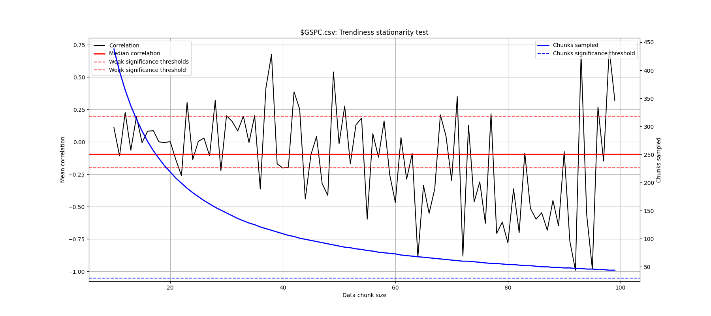
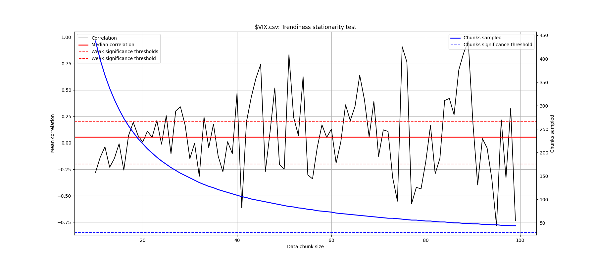
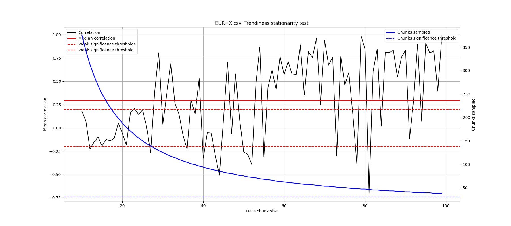
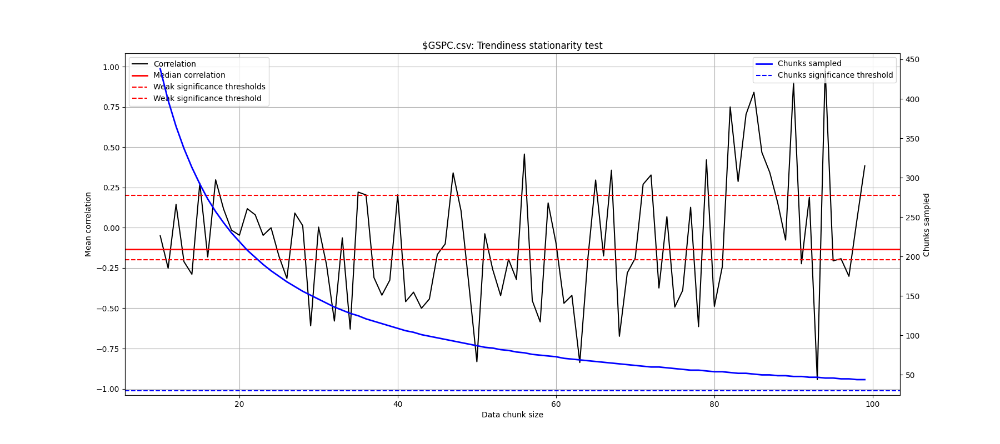
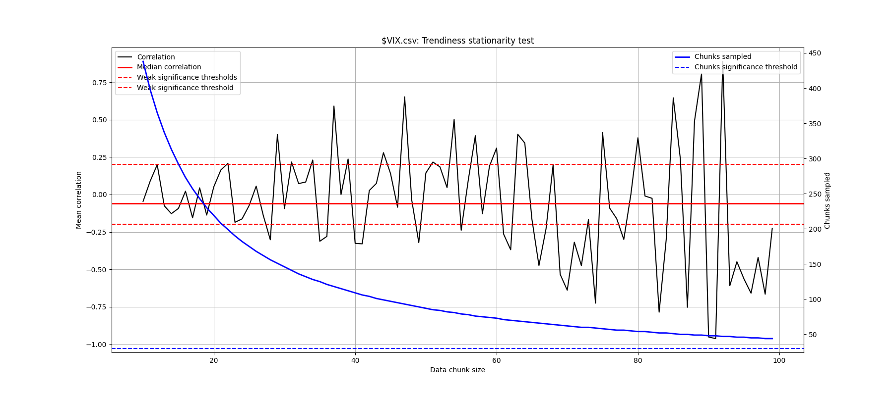
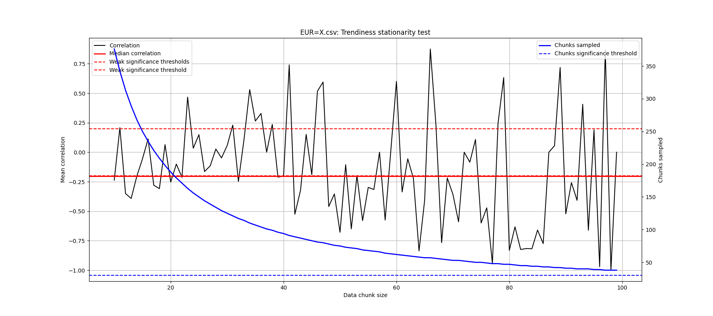

# The Mystery of Trends
People talk about things they call "trends." Two things therefore concern us:
- Are trends coherent? Do they really exist? In other words, can we *define* what a trend actually is, and find evidence of such a thing?
- If so, can we predict the onset of a trend?

To answer the first question we need to define what a trend is. We have many options, but most simply we might try:

## Definition 1
$$T = \frac{\lvert \sum_{t=0}^{n}r_t \rvert}{\sum_{t=0}^{n}\lvert r_t \rvert} $$

with

$$
\begin{equation}
{r_t} = \frac{p_t}{p_t-1}-1
\enspace,\enspace {P} = \{p_0, p_1, p_2, \dots \enspace p_n \in R \enspace | \enspace p_t > 0\}, \enspace p_t \in P
\end{equation}
$$

In other words trendiness is a coefficient corresponding to the ratio of signed to unsigned returns over a set of prices $P$. 

Now if we go with this definition then the trendiness of the full series isn't of interest to us, because it disproportionately depends upon $p_0$ and $p_n$, and if these happen to be the same then $T$ = 0 regardless of the price evolution. Rather, we are interested in identifying smaller trends somewhere within it. So need to break up the price data into chunks and check each of these for trendiness. We have not defined what $T$ constitutes a trend and would prefer not to introduce a specific constraint, since the choice is essentially arbitrary. Similarly, we don't know what chunk size $n$ might be important, so we will investigate the range $10 < n < 100$.

We therefore proceed as follows:
- split the data into consecutive same-size chunks of training and test data
- calculate $T$ for the training chunks, and discard the smallest 90% of such samples
- calculate the correlation of $T_train$ to $T_test$ for the remaining data

```
# our trendiness lambda
trendiness = lambda chunk: abs(sum(chunk)) / np.sum([abs(r) for r in chunk])

def test_stationarity(symbol_path):
  retain = 0.1 # top 10% of chunks by trendiness
  results, dfl = [], data_file_loader({"path": symbol_path})
  returns = [dfl.series[dt]["next_delta"] for dt in dfl.s_dates]
  for chunk_size in range(10, 100, 1):
    chunks = [returns[i:i+chunk_size] for i in range(0, len(returns), chunk_size)]
    samples = [{"train": trendiness(chunks[train_index]), "test": trendiness(chunks[train_index+1])} for train_index in range(len(chunks)-1)]
    df = pd.DataFrame(sorted(samples, key = lambda q: q["train"], reverse=True)[0:int(len(samples) * retain)])
    results.append({"chunk_size": chunk_size, "trendiness": np.corrcoef(df["train"], df["test"])[0][1], "n": len(samples)})
```
## S&P 500


# VIX


## EUR


What we're looking for is the solid red line (the median correlation of $T$ between the training and test chunks) outside limits of the dotted (-0.20, +0.20) weak significance thresholds. The first two charts are inconclusive, but the EUR chart suggests a weak correlation in the $60 < n < 100$ range.

## Definition 2
One shortcoming of our trendiness definition is that its numerator is overly sensitive to single-period jumps in price. Consider the case of a security strictly monotonically decreasing in price over the period with the exception of a single jump

$$r_j > \sum_{t=0}^{n}r_t | t != j$$

then $T > 0$, but would we really care to call this evidence of a trend? Let's try a different definition that addresses this shortcoming:

$$T = 2 * \lvert 0.5 - p(r_t > 0) \rvert $$

In other words, $T$ is the excess probability of non-random price movements within the data in question, and our lambda now becomes:

```
trendiness = lambda chunk: abs(0.5 - np.mean([r > 0 for r in chunk]))
```

## S&P 500


# VIX


## EUR


Again the first two plots are inconclusive. 
